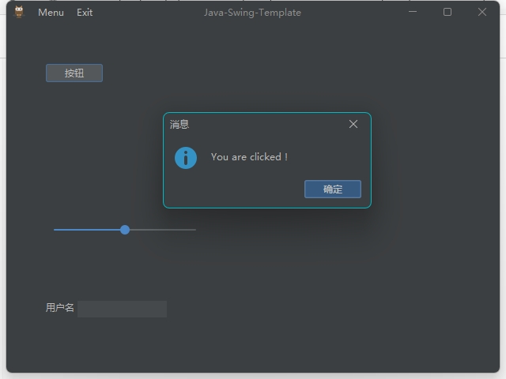

## Java-Swing-Template
- java的gui开发快速模版，支持jdk14+，maven构建，支持一键打包为exe、dmg等
- 当前使用的jdk17，理论上jdk14+都支持
- 采用模块化，支持一键打包生成很小的exe（目前20M左右）
- 采用了idea开发工具一样的主题，支持明亮和暗黑（再也不用担心java的swing丑啦）
- maven构建
  
---


# 介绍

- [JavaFX版本请看这里](https://gitee.com/52jian/JavaFX-Template-Native)
- Github开源地址：https://github.com/Janix520/Java-Swing-Template

# 打包
- 绿色版 mvn clean package exec:exec@jlink exec:exec@image
- 安装包 mvn clean package exec:exec@jlink exec:exec@installer

- 注意事项，修改pom.xml中javahome路径以及名称

```
    !--JAVA_HOME路径-->
    <javahome.path>D:/myProgram/jdk-17.0.7</javahome.path>
    <!-- 打包、镜像 统一名称 -->
    <pkg.imagename>APP</pkg.imagename>
    <!--厂商 -->
    <pkg.vendor>xxx有限公司</pkg.vendor>
    <!-- 描述 -->
    <pkg.description>Java-Swing-APP-Demo</pkg.description>
    <!-- 版权 -->
    <pkg.copyright>rocoplayer.com</pkg.copyright>
    <!-- 版本号 -->
    <pkg.version>1.0.0</pkg.version>
```

```

如需要打包MAC，自行将
<argument>-t</argument>
<argument>exe</argument>
改成需要的格式，参考jdk的jpackage支持的打包格式
```


- 启动应用 `.\target\nativeBuild\*.exe`

# 项目配置（app.properties）

```properties
title=Java-Swing-Template
icon=icon/icon.png
stage.width=640
stage.height=480
stage.resizable=true
```


# 项目截图


# 参与贡献

1.  Fork 本仓库
2.  新建 Feat_xxx 分支
3.  提交代码
4.  新建 Pull Request
